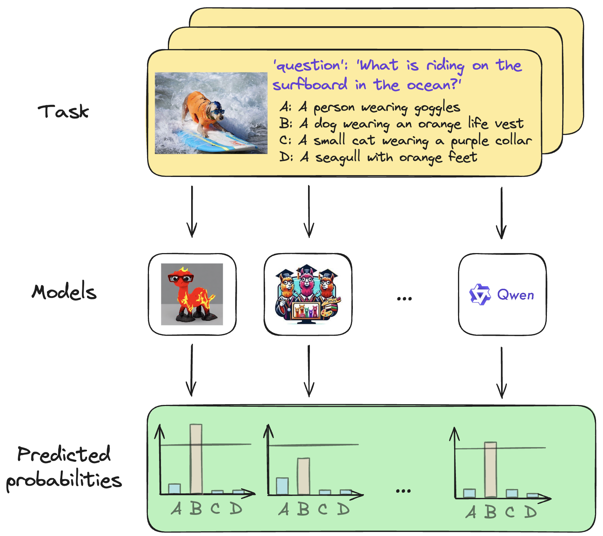

# Uncertainty-Aware Evaluation for Vision-Language Models


<p align="center">
  
</p>


## Introduction

## Datasets


## Evaluation

Accuracy Results 

| model_name             |    MB |   OOD |   SQA |    SB |  AI2D |  Avg. |
|:-----------------------|------:|------:|------:|------:|------:|------:|
| LLaVA-v1.6-Vicuna-13B  | 76.75 | 72.93 | 70.56 | 70.37 | 73.67 | 72.85 |
| Monkey-Chat            | 76.98 |  70.6 | 74.66 |  66.1 | 67.95 | 71.26 |
| LLaVA-v1.6-Vicuna-7B   | 75.56 |  73.7 | 65.86 | 69.06 | 69.75 | 70.78 |
| InternLM-XComposer2-VL | 71.77 | 70.04 | 77.95 | 64.44 | 66.13 | 70.07 |
| Yi-VL-6B               | 75.24 | 73.91 | 66.72 | 66.25 | 58.84 | 68.19 |
| CogAgent-VQA           | 74.78 | 68.57 | 67.12 | 68.01 |  58.2 | 67.34 |
| MobileVLM_V2-7B        | 75.97 | 66.53 | 72.33 | 66.71 | 53.55 | 67.02 |
| MoE-LLaVA-Phi2-2.7B    | 73.73 | 74.82 | 64.04 | 66.42 | 55.76 | 66.95 |
| mPLUG-Owl2             | 73.05 | 73.28 | 65.71 | 61.49 | 54.38 | 65.58 |
| Qwen-VL-Chat           |  71.4 | 54.22 | 63.23 | 59.79 | 65.09 | 62.74 |


Set Sizes Results 


| model_name             |  MMB |  OOD |  SQA |   SB | AI2D | Avg. |
|:-----------------------|-----:|-----:|-----:|-----:|-----:|-----:|
| LLaVA-v1.6-Vicuna-13B  | 2.34 | 2.18 | 2.45 | 2.49 | 2.33 | 2.36 |
| Monkey-Chat            |  2.7 | 2.92 | 2.56 | 3.26 | 3.19 | 2.93 |
| LLaVA-v1.6-Vicuna-7B   | 2.37 | 2.34 | 2.45 | 2.53 | 2.37 | 2.41 |
| InternLM-XComposer2-VL | 2.72 |  2.2 | 2.41 | 3.08 | 3.02 | 2.69 |
| Yi-VL-6B               | 2.47 | 2.02 | 2.76 | 2.61 |    3 | 2.57 |
| CogAgent-VQA           | 2.33 | 2.46 | 2.36 | 2.49 | 2.94 | 2.52 |
| MobileVLM_V2-7B        | 2.53 | 2.61 | 2.62 |  2.8 |  3.4 | 2.79 |
| MoE-LLaVA-Phi2-2.7B    | 2.54 | 1.89 |  2.7 | 2.69 | 2.92 | 2.55 |
| mPLUG-Owl2             | 2.55 | 2.09 | 2.71 | 2.93 |    3 | 2.65 |
| Qwen-VL-Chat           |  2.7 | 3.32 |  2.9 | 3.32 |  3.1 | 3.07 |


Uncertainty-aware Accuracy Results

| model_name             |   MMB |    OOD |   SQA |    SB |  AI2D |  Avg. |
|:-----------------------|------:|-------:|------:|------:|------:|------:|
| LLaVA-v1.6-Vicuna-13B  | 90.41 |  86.29 | 78.04 | 73.87 | 84.58 | 82.64 |
| Monkey-Chat            | 83.41 |  63.22 |  81.7 | 52.49 | 56.08 | 67.38 |
| LLaVA-v1.6-Vicuna-7B   | 87.87 |  82.81 | 69.77 | 70.69 |  77.2 | 77.67 |
| InternLM-XComposer2-VL | 69.98 |  80.49 | 94.37 |  52.6 |  56.4 | 70.77 |
| Yi-VL-6B               | 84.56 |  95.05 | 64.01 | 64.56 | 49.31 |  71.5 |
| CogAgent-VQA           | 85.56 |  71.14 |  72.4 | 69.96 |    49 | 69.61 |
| MobileVLM_V2-7B        | 84.19 |  64.35 | 79.07 | 62.18 | 39.39 | 65.84 |
| MoE-LLaVA-Phi2-2.7B    | 82.83 | 100.73 | 61.18 | 64.67 | 47.87 | 71.46 |
| mPLUG-Owl2             |  78.4 |  89.24 | 62.92 | 52.91 | 45.09 | 65.71 |
| Qwen-VL-Chat           | 69.58 |  40.28 | 54.71 |  44.7 |  54.3 | 52.71 |

## Getting started


6 groups of models could be launch from one environment: LLaVa, CogVLM, Yi-VL, Qwen-VL,
internlm-xcomposer, MoE-LLaVA. This environment could be created by the following code:
```shell
python3 -m venv venv
source venv/bin/activate
pip install git+https://github.com/haotian-liu/LLaVA.git 
pip install git+https://github.com/PKU-YuanGroup/MoE-LLaVA.git --no-deps
pip install deepspeed==0.9.5
pip install -r requirements.txt
pip install xformers==0.0.23 --no-deps
```
mPLUG-Owl model can be launched from the following environment:
```shell
python3 -m venv venv_mplug
source venv_mplug/bin/activate
git clone https://github.com/X-PLUG/mPLUG-Owl.git
cd mPLUG-Owl/mPLUG-Owl2
git checkout 74f6be9f0b8d42f4c0ff9142a405481e0f859e5c
pip install -e .
pip install git+https://github.com/haotian-liu/LLaVA.git --no-deps
cd ../../
pip install -r requirements.txt
```
Monkey models can be launched from the following environment:
```shell
python3 -m venv venv_monkey
source venv_monkey/bin/activate
git clone https://github.com/Yuliang-Liu/Monkey.git
cd ./Monkey
pip install -r requirements.txt
pip install git+https://github.com/haotian-liu/LLaVA.git --no-deps
cd ../
pip install -r requirements.txt
```

To check all models you can run ```scripts/test_model_logits.sh```


To work with Yi-VL:
```shell
apt-get install git-lfs
cd ../
git clone https://huggingface.co/01-ai/Yi-VL-6B
```


### Model logits

To get model logits in four benchmarks run command from `scripts/run.sh`.

### To quantify uncertainty by logits

```shell
python -m uncertainty_quantification_via_cp --result_data_path 'output' --file_to_write 'full_result.json'
```

### To get result tables by uncertainty

```shell
python -m make_tables --result_path 'full_result.json' --dir_to_write 'tables'
```

## Citation

```bibtex
@article{kostumov2024uncertainty,
  title={Uncertainty-Aware Evaluation for Vision-Language Models},
  author={Kostumov, Vasily and Nutfullin, Bulat and Pilipenko, Oleg and Ilyushin, Eugene},
  journal={arXiv preprint arXiv:2402.14418},
  year={2024}
}
```

## Acknowledgement

[LLM-Uncertainty-Bench](https://github.com/smartyfh/LLM-Uncertainty-Bench): conformal prediction applied to LLM. Thanks for the authors for providing the framework.


## Contact
We welcome suggestions to help us improve benchmark. For any query, please contact us at v.kostumov@ensec.ai. If you find something interesting, please also feel free to share with us through email or open an issue. Thanks!

